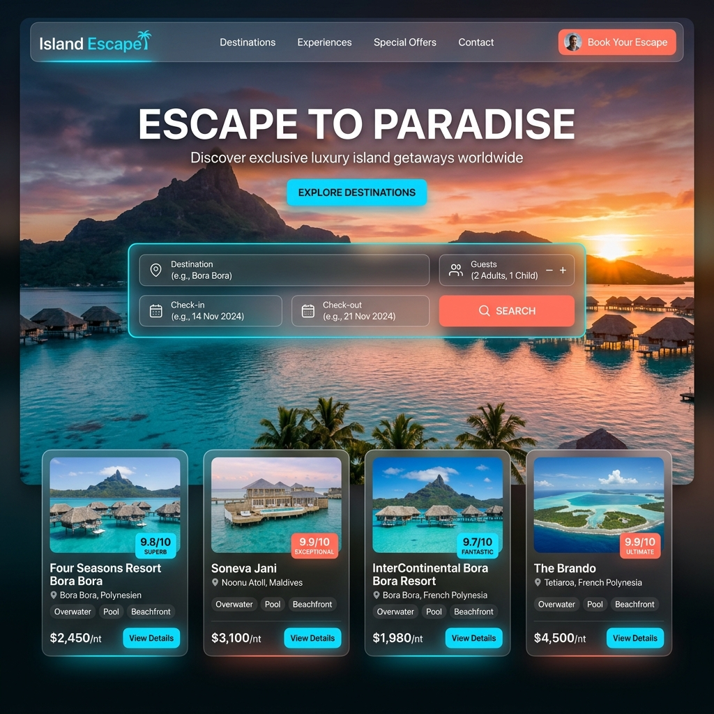
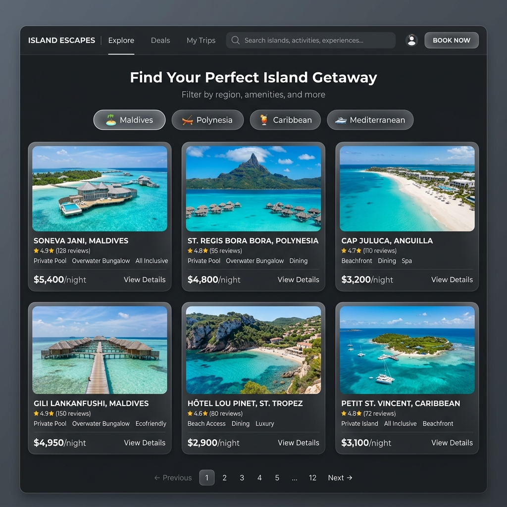
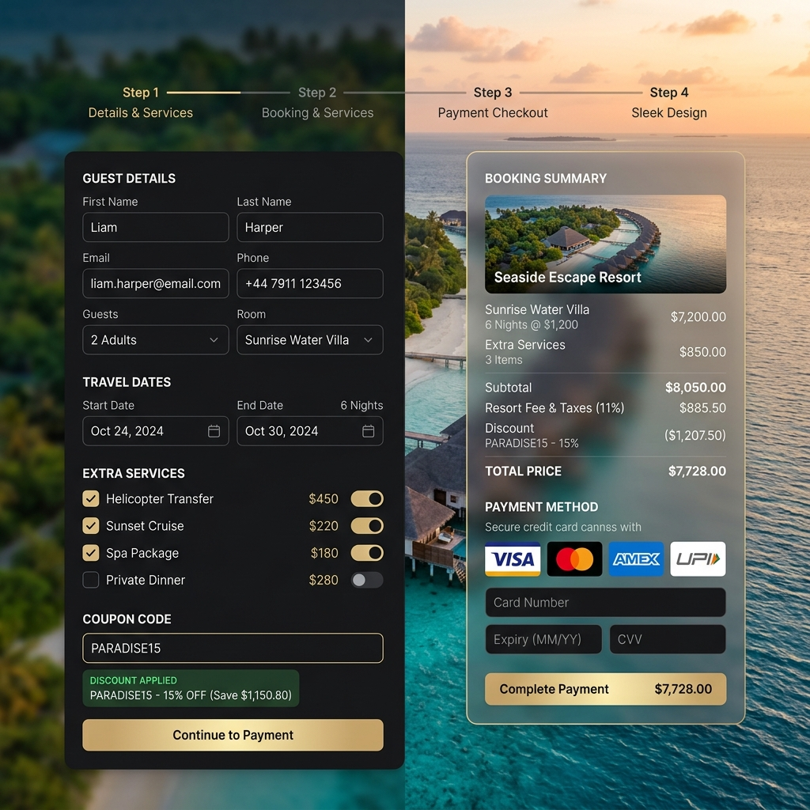
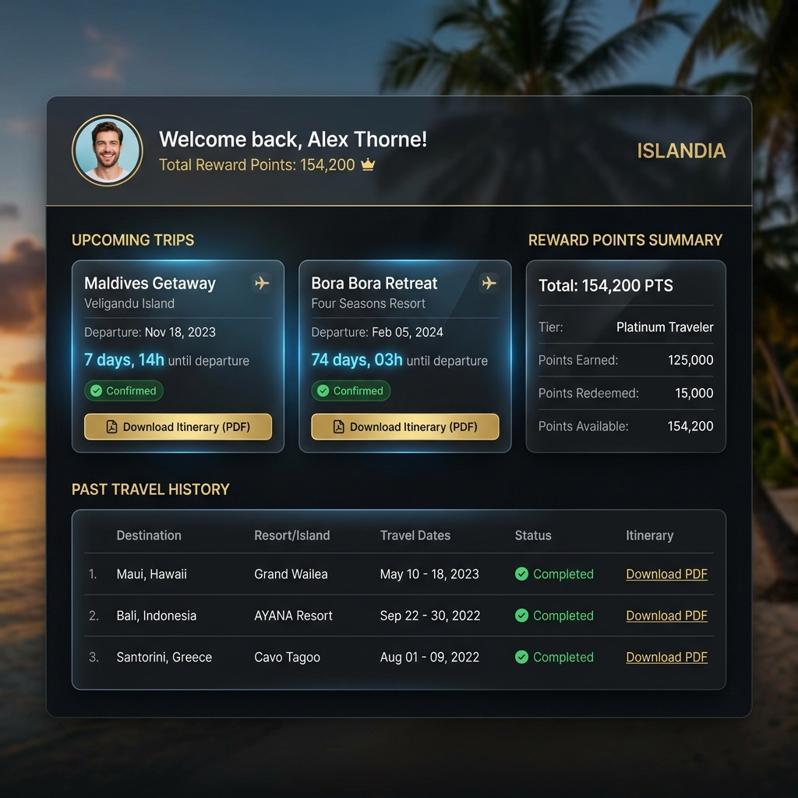
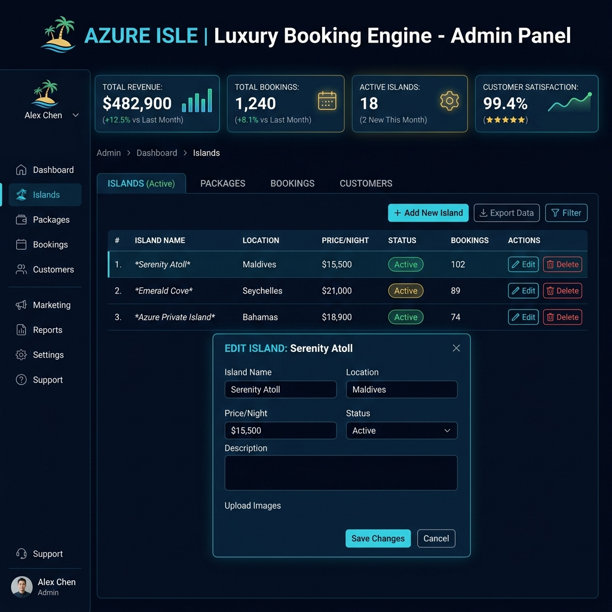
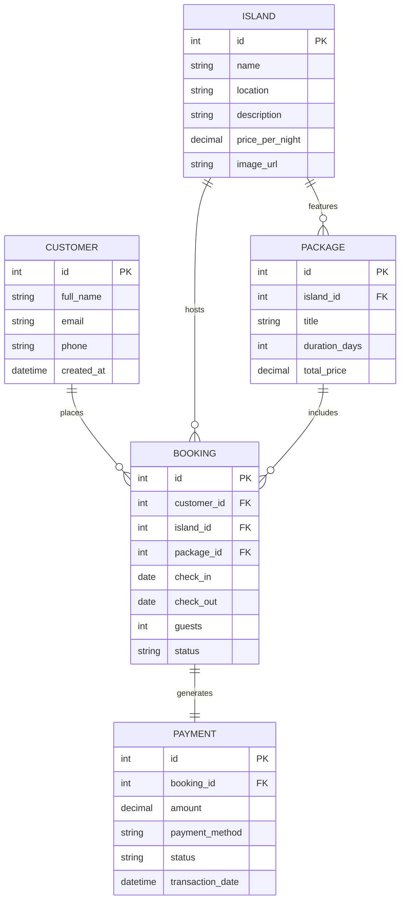

# 🌴 Island Escape – Commercial-Grade Luxury Island Booking Engine 🌊

[](https://www.python.org/)
[](https://www.djangoproject.com/)
[](https://www.sqlite.org/)
[](https://developer.mozilla.org/en-US/docs/Web/JavaScript)
[](https://www.w3.org/Style/CSS/)
[](LICENSE)

> 🏝️ **Island Escape** is a commercial-grade, full-stack tourism & luxury resort reservation platform engineered with a high-performance **Django Function-Based REST API**, **SQLite relational database**, and a bespoke **Glassmorphism UI** driven by standard HTML5, CSS3 micro-animations, and asynchronous ES6 Vanilla JavaScript (`Fetch API`).

---

## 📌 Table of Contents
- [🌟 Key Features \& Highlights](#-key-features--highlights)
- [📸 Application Screenshots \& Interface Showcase](#-application-screenshots--interface-showcase)
- [💻 Technology Stack \& Source Code Architecture](#-technology-stack--source-code-architecture)
- [📁 Project Repository Structure](#-project-repository-structure)
- [🔌 REST API Endpoint Reference](#-rest-api-endpoint-reference)
- [⚡ Quick Start \& Local Setup Guide](#-quick-start--local-setup-guide)
- [🗄️ Database Schema \& Entity Models](#️-database-schema--entity-models)
- [🧪 Automated Test Suite](#-automated-test-suite)
- [🤝 Contributing \& License](#-contributing--license)

---

## 🌟 Key Features & Highlights

- 💎 **Luxury Island Tourism UI/UX**: Ultra-premium dark mode glassmorphism interface featuring high-definition tropical photography, soft glow elevation shadows, and smooth micro-animations.
- ⚡ **Zero External Heavy Frameworks**: Pure Vanilla JavaScript and CSS custom properties delivering lightning-fast load times without external bundles.
- 🔄 **Full RESTful CRUD Capabilities**: 5 fully integrated entities—**Islands**, **Packages**, **Customers**, **Bookings**, and **Payments** with modal popups for seamless inline administration.
- 🎯 **Interactive Search & Multi-Criteria Filtering**: Filter destinations by region, budget, activity tags, and price ranges instantly.
- 🛒 **Multi-Step Dynamic Reservation Wizard**: Real-time stay duration auto-calculation, guest counters, coupon discount engine (`PARADISE15`), and price breakdown.
- 💳 **Mock Checkout Payment Gateway**: Multi-method transaction processor supporting Visa, Mastercard, UPI, and NetBanking with dynamic receipt generation.
- 📊 **Dual Administrative & Traveler Dashboards**:
  - 👤 **Traveler Portal**: View upcoming luxury itineraries, active trip status, and booking history.
  - 🛡️ **Admin Suite**: Real-time analytical KPI counters (Total Revenue, Total Bookings, Active Islands) alongside full CRUD controls.

---

## 📸 Application Screenshots & Interface Showcase

### 1. 🏝️ Main Landing & Hero Section (`/`)
*Vibrant welcome landing featuring luxury resort search, quick filter widgets, and top-rated tropical destinations.*


---

### 2. 🌍 Filterable Islands & Destinations Directory (`/islands-page/`)
*Interactive catalog with real-time category filters, price tags per night, and detailed amenity badges.*


---

### 3. 📝 Dynamic Booking & Payment Gateway (`/booking/` & `/payment/`)
*Seamless multi-step booking wizard with instant coupon calculation, guest management, and checkout.*


---

### 4. 👤 Traveler Analytics Dashboard (`/customer-dashboard/`)
*Personalized passenger portal displaying active upcoming itineraries, travel history, and confirmation receipts.*


---

### 5. 🛡️ Administrative Management & Analytics Panel (`/admin-dashboard/`)
*Comprehensive operational center featuring real-time metric cards, financial analytics, and modal popups for database records.*


---

## 💻 Technology Stack & Source Code Architecture

| Layer | Technology | Details & Role |
| :--- | :--- | :--- |
| **Backend Framework** | 🐍 **Python 3.10+ / Django 5.0+** | Modular Django application utilizing function-based views for clean RESTful endpoints |
| **Database** | 🗄️ **SQLite3** | Relational schema with Foreign Keys, Cascading updates, and indexed lookup fields |
| **Frontend UI** | 🎨 **HTML5 & Vanilla CSS3** | Custom Glassmorphic design tokens, Flexbox/Grid layouts, and keyframe animations |
| **Dynamic Logic** | ⚡ **Vanilla ES6 JavaScript** | Asynchronous `Fetch API` wrappers, DOM manipulation, coupon rules, and modal dialogs |
| **Iconography & Fonts**| 🔤 **Google Fonts & FontAwesome 6** | `Outfit` (Headings) & `Poppins` (Body Text) paired with FontAwesome vector icons |

---

## 📁 Project Repository Structure

```tree
Island-Booking-System/
│
├── 📂 booking_app/                  # Primary Core Django Application
│   ├── 📂 migrations/              # Database Schema Version History & Migrations
│   ├── 📜 admin.py                 # Django Admin Interface Registration
│   ├── 📜 apps.py                  # Application Configuration
│   ├── 📜 models.py                # Database Models (Customer, Island, Package, Booking, Payment)
│   ├── 📜 tests.py                 # Django Unit Test Suite
│   ├── 📜 urls.py                  # API Endpoints & View Routing Setup
│   └── 📜 views.py                 # Function-Based API View Logic & JSON Response Serialization
│
├── 📂 island_booking/              # Django Main Project Settings
│   ├── 📜 settings.py              # Application Settings, Middleware, Templates & Static Paths
│   ├── 📜 urls.py                  # Master URL Dispatcher & Route Inclusion
│   ├── 📜 wsgi.py                  # WSGI Web Server Interface
│   └── 📜 asgi.py                  # ASGI Asynchronous Server Gateway Interface
│
├── 📂 static/                      # Static Assets & Styling
│   ├── 📂 css/
│   │   └── 📜 style.css            # Custom Glassmorphism Styling & Responsive Utilities
│   └── 📂 js/
│       └── 📜 script.js            # Fetch API Engine, Dynamic UI Handlers & Modal Controllers
│
├── 📂 templates/                   # Frontend HTML View Templates
│   ├── 📜 index.html               # Main Landing & Hero Section
│   ├── 📜 login.html               # Member Sign In Interface
│   ├── 📜 register.html            # New Account Registration Form
│   ├── 📜 islands.html             # Filterable Islands Catalog
│   ├── 📜 packages.html            # Vacation Package Bundles Directory
│   ├── 📜 booking.html             # Multi-Step Reservation Wizard
│   ├── 📜 payment.html             # Checkout & Payment Gateway Modal
│   ├── 📜 customer_dashboard.html   # Traveler Analytics & Itineraries View
│   └── 📜 admin_dashboard.html     # Admin Management Panel & Metric Counters
│
├── 📂 docs/
│   └── 📂 screenshots/             # Visual UI Screenshots for Repository Documentation
│       ├── 🖼️ homepage.png
│       ├── 🖼️ islands_catalog.png
│       ├── 🖼️ booking_wizard.png
│       ├── 🖼️ customer_dashboard.png
│       └── 🖼️ admin_panel.png
│
├── 🗄️ db.sqlite3                   # Pre-seeded SQLite Database Engine
├── 📜 manage.py                    # Django Administrative Command-Line Utility
├── 📜 seed_db.py                   # Automated Database Seeding Script with Sample Destinations
└── 📜 test_api.py                 # Automated REST API Verification & CRUD Integration Suite
```

---

## 🔌 REST API Endpoint Reference

### 🏝️ Islands Management (`/islands/`)
- `GET    /islands/` ➔ Retrieve all tropical island destinations
- `POST   /islands/add/` ➔ Create a new island entry
- `PUT    /islands/update/<id>/` ➔ Update existing island specifications
- `DELETE /islands/delete/<id>/` ➔ Remove island record

### 📦 Vacation Packages (`/packages/`)
- `GET    /packages/` ➔ Retrieve all holiday package bundles
- `POST   /packages/add/` ➔ Create a new vacation package
- `PUT    /packages/update/<id>/` ➔ Update package details and pricing
- `DELETE /packages/delete/<id>/` ➔ Delete vacation package

### 👥 Customer Records (`/customers/`)
- `GET    /customers/` ➔ List registered customer profiles
- `POST   /customers/add/` ➔ Register a new customer record
- `PUT    /customers/update/<id>/` ➔ Modify customer profile details
- `DELETE /customers/delete/<id>/` ➔ Delete customer account

### 📅 Booking Reservations (`/bookings/`)
- `GET    /bookings/` ➔ Fetch all trip bookings
- `POST   /bookings/add/` ➔ Submit a new reservation
- `PUT    /bookings/update/<id>/` ➔ Modify booking dates or status (`Confirmed`, `Pending`, `Cancelled`)
- `DELETE /bookings/delete/<id>/` ➔ Cancel and remove booking record

### 💳 Financial Payments (`/payments/`)
- `GET    /payments/` ➔ Fetch payment transactions ledger
- `POST   /payments/add/` ➔ Execute a new payment transaction
- `PUT    /payments/update/<id>/` ➔ Update transaction status
- `DELETE /payments/delete/<id>/` ➔ Delete payment record

---

## ⚡ Quick Start & Local Setup Guide

### 1. 📥 Clone the Repository
```bash
git clone https://github.com/hemanthc29/Island-Booking-System.git
cd Island-Booking-System
```

### 2. 🐍 Create & Activate Virtual Environment
```bash
# Windows
python -m venv venv
venv\Scripts\activate

# macOS / Linux
python3 -m venv venv
source venv/bin/activate
```

### 3. 📦 Install Dependencies
```bash
pip install django
```

### 4. 🗄️ Run Migrations & Seed Database
```bash
python manage.py makemigrations
python manage.py migrate
python seed_db.py
```

### 5. 🚀 Launch Development Server
```bash
python manage.py runserver
```
Navigate to `http://127.0.0.1:8000/` in your web browser. 🌐

---

## 🗄️ Database Schema & Entity Models



---

## 🧪 Automated Test Suite

Run the comprehensive automated REST API verification test suite:

```bash
python test_api.py
```

The script performs automated endpoint health checks, CRUD operations verification, payload validation, and HTTP status code assertion across all 5 model entities.

---

## 🤝 Contributing & License

Contributions, issues, and feature requests are welcome!  
Feel free to check out the [issues page](https://github.com/hemanthc29/Island-Booking-System/issues).

Distributed under the **MIT License**. See `LICENSE` for more information.

---

<p center>
Made with ❤️ & 🌴 for luxury island travel enthusiasts worldwide.
</p>
